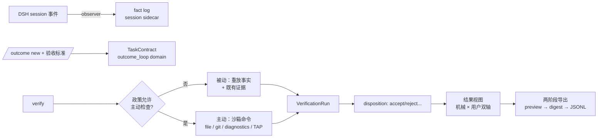

# dsh-outcome-loop

任务结果账本与验收插件 · Task outcome ledger & acceptance plugin for DeepSeek Harness (DSH)

**用尽量零 token、可机械复核的证据，帮助用户知道任务是否真的完成，并把结果沉淀为用户自己的可迁移经历。**

`dsh-outcome-loop` 是一个本地优先、用户所有、厂商中立的任务结果账本与验收插件。它把一次 DSH 会话中的目标、约束、验收条件、执行证据、用户反馈、成本和最终结果组织成可复查的任务记录。

- **阻止"模型说完成了"被误当成"任务真的完成了"**：验收以测试、构建、lint、退出码、文件状态、诊断输出、git 变更范围等机械证据为准；
- **默认零额外模型成本**：不发起额外 LLM 调用、不注册模型可见工具、不注入 system prompt；
- **默认本地、默认无网络**：所有结果数据保存在用户自己的 DSH storage backend；
- **用户拥有并控制数据**：可查看、删除、导出，导出前可预览脱敏结果；
- **区分成功、失败、未验证、证据过期、用户接受和用户放弃**，绝不把未知自动转换为成功。

## 快速开始

### 安装

```bash
# 从源码构建
pnpm install
pnpm build
pnpm pack   # 生成 dsh-outcome-loop-<version>.tgz

# 安装进 DSH profile
dsh plugin --profile <name> add ./dsh-outcome-loop-0.1.0-beta.8-keeyahto.1.tgz
```

> **前置条件 —— `storageDomain`（真实宿主验证）**：插件必需 `storageDomain`
> 服务，但官方 **`dsh-base` bundle 不含 storage 行**（只有 `@deepseek-ai/dsh-web-app`
> 等上层 bundle 提供；`web` profile 自带）。在裸/headless profile 上需补一次：
>
> ```bash
> dsh plugin --profile <name> add @deepseek-ai/dsh-storage-domain@0.1.0-rc.8
> # 然后在 ~/.dsh/profiles/<name>/cordis.patch.yml 追加：
> # - insert:
> #     - id: storage
> #       name: "@deepseek-ai/dsh-storage"
> #     - id: storage-json
> #       name: "@deepseek-ai/dsh-storage-json"
> #       config:
> #         root: !!js dshHomePath("storages")
> #     - id: storage-domain
> #       name: "@deepseek-ai/dsh-storage-domain"
> #       config:
> #         backend: json
> ```
>
> 缺失时 profile 启动会 fail loud（`waiting for service: storageDomain`，这是
> 有意的设计）；完整已验证生命周期见 [COMPATIBILITY.md](COMPATIBILITY.md) §4：
> add → dump-config → 启动 → 真实 `/outcome` 命令 → 重启读取 → 卸载。

Bundle 会挂载四个插件行（见 `cordis.patch.yml`）：

| 行 | 作用 |
| --- | --- |
| `outcome-loop` | 核心服务 `ctx.outcomeLoop` + session 观察器 + 本地 sidecar 存储 |
| `outcome-loop-commands` | 人类命令 `/outcome`（创建契约、验收、反馈、导出） |
| `outcome-loop-projection` | 可选 Web session 投影（headless 环境自动跳过） |
| `outcome-loop-contribute` | **默认未安装**：贡献模式数据集准备（需手动添加行 + `contribute.enabled: true`，见下） |

### 使用（通过 `/outcome` 命令）

```
/outcome new 修复登录页按钮在移动端溢出问题        # 创建任务契约
/outcome criterion add 移动端 375px 宽度下无横向滚动  # 添加验收标准（manual）
/outcome criterion add-command "pnpm test"          # 添加命令验收（退出码 0）
/outcome criterion add-test                          # 添加测试验收
/outcome criterion add-file dist/bundle.js          # 添加产物文件验收
/outcome criterion add-test --min-passed 2 --max-failed 1
                                                     # 结构化测试计数（TAP 输出自动解析）
/outcome verify                                     # 运行验收（被动观察，不执行新命令）
/outcome status                                     # 查看机械验证 + 用户 disposition 双轴结果
/outcome accept | reject | revise | abandon         # 用户对结果的态度（与机械验证独立）
/outcome export [<contract>]                             # 两阶段导出：预览 → digest
/outcome export <contract> --approve <digest> --out <path> [--overwrite]
                                                     # 批准并原子写入 JSONL 文件
/outcome exports [<contract>]                        # 列出导出 manifest
/outcome import <path>                              # 导入结构化 Task Contract 文件（outcome-loop.contract.v1）
/outcome export-contract <id> --out <path>          # 导出契约文件
/outcome cost [<contract>] [--summary]              # token 用量（可选价格表 → 货币成本估计；--summary 聚合多契约）
/outcome calibration [<contract>]                 # dsh-code-reference 决策校准（预测 × 实际）
/outcome skills [--out <path>]                    # Skill 候选（只读聚合，人工评估，永不自动应用）
/outcome delete <contract-id> --yes                 # 删除 sidecar 数据（会话日志永不触碰）
```

### 贡献模式（默认关闭，ADR-0005）

贡献模式是独立、默认未安装的消费者。手动添加到 profile 的 patch：

```yaml
- insert:
    - id: outcome-loop-contribute
      name: dsh-outcome-loop/lib/consumers/contribute.js
      config:
        enabled: true
```

```text
/contribute preview <contract>                 # 批次预览（字段/敏感命中/digest）
/contribute approve <digest> <contract> --out <dir> [--summary-only]
                                               # 写入 consent manifest + records.jsonl（或 summary.json）
/contribute revoke <contract> --out <dir> --yes  # 撤回 = 删除数据集目录
```

数据集只包含导出 v1 最小字段（无消息正文/代码/凭据/绝对路径），确定性脱敏门在任何敏感命中时阻断整批；插件**不执行任何上传**，交付由用户自行决定。

### 通过 Host API

```ts
import type { Context } from '@deepseek-ai/cordis'

// 创建契约
const created = await ctx.outcomeLoop.createContract({
  sessionId: session.id,
  goalText: '修复登录 bug',
  workspaceRoot: session.header.cwd,
  criteria: [
    { description: 'pnpm test 通过', kind: 'command-exit',
      specification: { kind: 'command-exit', command: 'pnpm test', expectExitCode: 0 } },
  ],
})
// created: OutcomeResult<TaskContract>

// 运行验收（被动：只观察已有事件，绝不自动执行命令）
const run = await ctx.outcomeLoop.verify({ contractId: created.value.id })

// 用户 disposition（与机械验证独立的两条轴）
await ctx.outcomeLoop.setDisposition({ contractId, status: 'accepted' })

// 两阶段导出
const preview = await ctx.outcomeLoop.previewExport({ contractId })
const receipt = await ctx.outcomeLoop.exportJsonl({ contractId, previewDigest: preview.value.previewDigest })

// 记录 dsh-code-reference（或任意集成）的先前决策证据（§15，只用于用户校准）
await ctx.outcomeLoop.recordDecisionEvidence({
  contractId,
  source: 'dsh-code-reference',
  decisionId: 'decision-42',
  strategy: 'reuse',
  predictedMatch: 0.87,
})
```

完整 API 见 `src/service.ts` 的 `OutcomeLoopApi`。

## 运行时流程



主动验证**默认永不运行**：每次调用都经过政策层门控（`autoRun`、`allowedVerifierIds`、超时、输出上限、白名单 env）。命令一律 argv 直启，绝不经过 shell 字符串求值。

### 主动验证器安全（beta.8）

- **基础设施错误一律 `unknown`**：超时、启动失败、输出截断的命令绝不进入 pass/fail 解析；`git-scope` 要求两条 git 命令都成功退出（非 git 目录 → `unknown`，绝不 `pass`，git 错误输出不会被解析成变更路径）；`diagnostic-count` 把"非零退出且解析不到任何诊断"视为 `unknown`（工具崩溃），同时保留 tsc/eslint 语义（非零退出 + 有诊断 → `fail`）；
- **工作区边界基于 realpath**：所有用户/契约提供的路径都与工作区根的 `realpath` 做包含性校验——读（`file-exists`、`file-digest`、`json-schema`、JUnit `reportPath`、契约导入）与写（导出 `--out`、contribute approve/revoke）都会拒绝指向工作区之外的符号链接（`unknown`/报错，绝不 pass）；工作区内部符号链接不受影响。

## 概念模型

任务结果不是一个布尔值，至少维护五条互相独立的轴（详细规则见 [ARCHITECTURE.md](ARCHITECTURE.md) 与 `src/domain/reducer.ts`）：

| 轴 | 典型值 |
| --- | --- |
| 执行状态 | `active` / `ended` / `aborted` / `blocked` |
| 验证状态 | `not-run` / `passed` / `failed` / `inconclusive` |
| 用户 disposition | `none` / `accepted` / `rejected` / `revised` / `abandoned` |
| 标签强度 | `strong` / `medium` / `weak` / `unknown` |
| 数据资格 | `private-only` / `exportable` / `contribution-approved` |

机械验证失败时，用户仍可以出于其他原因接受结果；用户接受也不能抹去机械失败。两者同时保留。

## 验收聚合规则（摘要）

1. 任一 required + blocking criterion 为 `fail` → 总验证 `failed`；
2. 无失败但至少一个 required criterion 为 `unknown` → `inconclusive`；
3. 全部 required 为 `pass`/`not-applicable` → `passed`；
4. 未执行任何验证 → `not-run`；
5. warning criterion 不改变 passed/failed，但必须展示；
6. 互相冲突的当前证据默认 → `inconclusive`，绝不挑选对成功有利的一条；
7. contract revision 变化、workspace 变化、超龄 → 旧证据 `stale`，stale 不参与 pass；
8. 用户 acceptance 只改变 disposition，不改变机械验证结果；
9. LLM Judge（未来独立插件）最多产生 `weak` 标签。

## 隐私与安全（摘要）

- 默认零模型调用、零网络、零主动命令执行；
- 只保存结构化事实：命令摘要、退出码、计数、digest、seq 引用 —— **绝不复制**完整 prompt、工具参数、工具输出、源代码或消息正文；
- outcome 数据存独立 sidecar domain（`outcome_loop`），**永不写入 session log**，不进入 telemetry；
- 导出是显式的两阶段操作：preview（含 digest）→ 批准（digest 绑定，内容变化即失效）；
- 完整威胁模型见 [SECURITY.md](SECURITY.md)，默认配置硬门槛见 [PRIVACY.md](PRIVACY.md)。

## 目录结构

```text
src/
├── domain/        # 纯领域层：ids / types / errors / reducer / aggregate / freshness（无 DSH 依赖）
├── dsh/           # DSH 适配层：events 归一化 / observer / replay / registry / token-bridge / feedback-bridge / compatibility
├── persistence/   # storage-domain sidecar：schema / repository / queue / repair
├── verification/  # 验证引擎：registry / policy / engine / adapters(passive, active) / paths（realpath 边界）
├── export/        # 导出：redact / schema / preview / jsonl
├── consumers/     # /outcome 命令 + 可选 projection（只调用 service，不含领域真相）
├── service.ts     # ctx.outcomeLoop（OutcomeLoopApi）
├── config.ts      # Schemastery 配置（默认值锁定安全侧）
└── index.ts       # 插件入口
```

## 开发

```bash
pnpm install
pnpm typecheck     # tsc --noEmit
pnpm lint          # eslint
pnpm test          # vitest（151 用例）
pnpm test:coverage # 覆盖率（带阈值；安全关键代码目标 100% branch）
pnpm build         # tsc → lib/
pnpm pack          # npm tarball（dsh plugin add 安装）
pnpm smoke         # plain Node 导入构建产物冒烟
```

测试矩阵：Node 22.19+ / Node 24（`engines`），CI 见 `.github/workflows/ci.yml`。覆盖率阈值（statements 80 / branches 68 / functions 80 / lines 80）在 CI 中强制执行；安全关键模块（路径边界、consumers）从不被排除出度量。

## 与 dsh-code-reference 的关系

[dsh-code-reference](https://github.com/victorzhong0110/dsh-code-reference) 负责开发前的候选发现与复用决策；本插件负责开发后的事实校验。二者独立安装、单向可选集成：outcome-loop 不 import code-reference 的内部文件。

## 文档

- [ARCHITECTURE.md](ARCHITECTURE.md) — 架构决策、分层规则、事件流、重放与幂等
- [PRIVACY.md](PRIVACY.md) — 默认隐私硬门槛与数据最小化
- [SECURITY.md](SECURITY.md) — 威胁模型与控制
- [DATA_FORMAT.md](DATA_FORMAT.md) — sidecar 表结构与开放导出格式
- [COMPATIBILITY.md](COMPATIBILITY.md) — DSH 兼容矩阵与发布基线
- [CHANGELOG.md](CHANGELOG.md) — 变更记录

## License

MIT — 详见 [LICENSE](LICENSE)。

**DSH 兼容性声明**：本插件针对 DeepSeek Harness `0.1.0-rc.7` 开发并验证（见 [COMPATIBILITY.md](COMPATIBILITY.md)）。DSH 处于 developer preview，API 可能发生破坏性变化；升级前请核对兼容矩阵。
